# Plasma Linux 公式 ウェブサイト
## 概要
Plasma Linux の公式ウェブサイトです．

このウェブサイトは 静的サイトジェネレータ (Static Site Generator) の [Hugo](https://gohugo.io) を利用して作成しています．

さらにGitHub Actionを利用しており，このレポジトリを更新するたびに，ウェブサイトを `https://plasmalinux.github.io/` にデプロイします．

## レポジトリ管理方針
このレポジトリは以下のように運用してください．




## 記事作成方法
### 準備
記事を作成する環境にgitとhugoを導入します．hugoのインストール方法は以下のとおりです．
- Debian/Ubuntu の場合
    ```
    sudo apt install hugo
    ```

- macOS の場合
    ```
    brew install hugo
    ```

### リポジトリの取得
このリポジトリを`git clone`を使って取得します．
```
mkdir github
cd github
git clone git@github.com:PlasmaLinux/plasmalinux.github.io.git
```

### 記事の追加
以下のコマンドを実行し，記事用のMarkdownファイルを作成します．
```
cd plasmalinux.github.io
hugo new post/2023-04-08-sample.md
```

以下の内容の`plasmalinux.github.io/content/post/2023-04-08-sample.md`が作成されます 

``` {markdown}
---
title: "2023 04 08 Sample"
date: 2023-04-07T20:23:48+09:00
draft: true
---

```
title を変更し，記事を作成します．

*(記事を追加する時は，mainリポジトリにpushせず，branchを作成して，PullRequestを出すようにした方がいいと思う)*


### 記事のpreview
プレビュー用のserverを起動し，`http://localhost:1313/` をブラウザで開いて，内容を確認します．
```
cd plasmalinux.github.io
hugo server -D
```

### 記事の発行
*ここからの作業は慎重に行いましょう．*

プレビューで記事の内容にミスがないのを確認したら，記事の日付を修正し，記事の`draft: true`を`draft: false`に変更します．

変更後，リモートリポジトリにpushします．
```
cd plasmalinux.github.io
git add *
git commit -m "コミットメッセージ"
git push
```

*(mainリポジトリにpushせず，branchを作成して，PullRequestを出すようにした方がいいと思う)*

main リポジトリに変更が反映されれば，GitHub Actsionにより，サイトが生成され，デプロイされます．

## 参考文献
- Hugo > Get Started: https://gohugo.io/getting-started/
